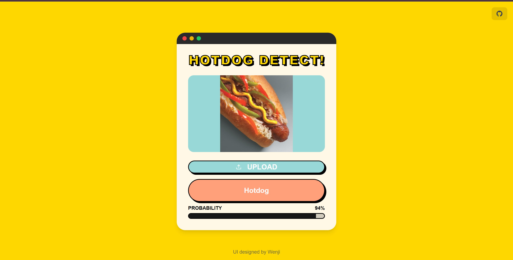

# Hotdog/Not Hotdog
### 1. Project description
If you've seen Silicon Valley, you must be familiar with this application designed by Jian Yang. We chose to implement the complete process of building and deploying the hotdog/nothotdog model as the project for our course [DTU-MLOps](https://skaftenicki.github.io/dtu_mlops/#course-organization). The primary goal of this project is to train a deep learning model that classifies images as either containing a hotdog or not. It's not a difficult task, but it's a good way for us to get familiar with the Machine Learning Operations.


For this project, we will leverage the dataset available on Kaggle: [Hotdog-NotHotdog](https://www.kaggle.com/datasets/thedatasith/hotdog-nothotdog). This dataset provides labeled images of hotdogs and non-hotdogs, and it has already been split into training set and test set, which makes it an ideal candidate for training and evaluating a supervised deep learning model. While the dataset’s size and diversity will influence the model’s performance, basic preprocessing steps, such as resizing images to a fixed size (e.g., 128x128), normalizing pixel values, and data augmentation (e.g., rotations, flips), will be applied to increase model robustness. We will utilize transfer learning by initializing ResNet18 with pre-trained weights on ImageNet, fine-tuning it for the hotdog classification task.

1. The deep learning framework chosen for this project is [PyTorch](https://github.com/huggingface/pytorch-image-models), known for its flexibility and ease of use in implementing neural networks. PyTorch provides comprehensive libraries and tools for training, validation, and visualization, making it the ideal choice for this image classification task.

2. The neural network architecture we will employ is [ResNet](https://arxiv.org/pdf/1512.03385) which is proposed by Kaiming in 2016, known for its effectiveness in extracting features from images due to its residual connections, which alleviate the vanishing gradient problem in deep networks.

During the whole project, we will focus on getting organized and be familiar with good development practices. Besides, we aim to have good version control and ensure the reproducibility. We ues below tools to achieve the whole project.

1. We use a [cookiecutter template](https://github.com/SkafteNicki/mlops_template) for getting started with Machine Learning Operations (MLOps).

2. Use the [GitHub](https://github.com/) (to store our code) and [DVC](https://dvc.org/) (to control data version, we usually store our data in Google Drive or GCP-cloud storage) to achieve the version control.

3. We use [Docker](https://skaftenicki.github.io/dtu_mlops/s3_reproducibility/docker/) and [Config Files](https://skaftenicki.github.io/dtu_mlops/s3_reproducibility/config_files/) to make our project reproducible.

4. During developing the code, we use [pdb](https://docs.python.org/3/library/pdb.html) to debug, use [loguru](https://loguru.readthedocs.io/en/stable/) to make logging and use [wandb](https://wandb.ai/site/) to tracking our training results and hardware performance.

5. We use [unit testing](https://skaftenicki.github.io/dtu_mlops/s5_continuous_integration/unittesting/) to validate the correctness of individual parts of the code base. Additionally, we use [GitHub Actions](https://skaftenicki.github.io/dtu_mlops/s5_continuous_integration/github_actions/) to automate the testing process, ensuring it is triggered every time we push code to our repository. By adopting a workflow where code is merged only after all automated tests have passed, we can ensure our codebase is reasonably protected against bugs.

6. We use the [Google Cloud Plantform](https://cloud.google.com/cloud-console?utm_source=google&utm_medium=cpc&utm_campaign=emea-dk-all-en-dr-bkws-all-all-trial-b-gcp-1707574&utm_content=text-ad-none-any-DEV_c-CRE_677656980138-ADGP_Hybrid+%7C+BKWS+-+MIX+%7C+Txt+-+Management+Developer+Tools+-+Cloud+Console-KWID_43700078358185187-kwd-296393718382-userloc_1005023&utm_term=KW_google+cloud+console-NET_g-PLAC_&&gad_source=1&gclid=Cj0KCQiA4rK8BhD7ARIsAFe5LXLNoBoJp6f8pX0X5ogMNQCTAIyH8VKE2te_VqQxpq0sPcrNSnFwap0aAgcjEALw_wcB&gclsrc=aw.ds&hl=en) during the whole project and It's really a powerful platform made by Google. We use [Google Cloud Build](https://cloud.google.com/build?hl=en) to build docker image, which are then uploaded to [Google Cloud Artifact Registry](https://cloud.google.com/artifact-registry/docs). Finally, [Google Cloud Run](https://cloud.google.com/run?hl=en) hosts the model-training jobs and the API services. The datasets and the trained model weights are saved in a Cloud Storage Bucket.


7. We use the [EVIDENTLY AI](https://skaftenicki.github.io/dtu_mlops/s8_monitoring/data_drifting/) to monitor data drifting and target drifting of our application. Each time we call the API, the backend automatically saves the attributes of the images we have used in a JSON file to the bucket in Cloud storage. In the end, we compare the saved data with our training data to check for drifting.

---

### 2. How to call our API?
Visit our application document [Document](https://zhumumu0216.github.io/MLOps/documents/api/), you can know more details about our application.

Besides, you can visit this website [Hotdog/notHotdog](https://dtuhotdogdetect.vercel.app/) directly to detect hotdog or not. Upload your image, and you will receive the prediction result. Due to the limited balance on our GCP account, you will not be able to access our website after mid-February.


---
### 3. Start our project on your local machine!
**ATTENTION:** Since we did lots of operations on the GCP(for example, downloading the pre-trained model from cloud storage), you also need to create your own GCP account and replace the project id, bucket name etc.

#### 1. Download the overall project files
1. Create your directory in your local machine.

2. Folk our repository / Create the git file and clone our repository

    ```dash
    git clone https://github.com/ZhuMuMu0216/MLOps.git
    ```

#### 2. Create venv
1. Create the virtual environment
    ```dash
    python -m venv venv       # create environment

    source venv/bin/activate  # Linux/macOS
    .\venv\Scripts\activate   # Windows

    pip install .             # install all the packages
    ```

#### 3. Download the dataset
1. You should enter the `MLOps` directory.

2. Run the below command in your terminal.
    ```
    dvc pull
    ```
#### 4. Run the code in docker
1. You should enter the `MLOps` directory.

2. Run the below command in your terminal, and you will build the docker image based on my dockerfile.

    ```bash
    docker build -t train_image -f dockerfiles/train.dockerfile .

3. Check your built docker image.
    ```bash
    docker images
    ```
    You will get below result and we can run the train_image now.
    | REPOSITORY  | TAG    | IMAGE ID      | CREATED        | SIZE  |
    |-------------|--------|---------------|----------------|-------|
    | train_image | latest | 311535037766  | 8 minutes ago  | 6.24GB |
4. As we didn't COPY the data into our docker image, we dynamically mount the Host's `data` Directory to the Container's `/data`.
    ```bash
    '''In Linux system'''
    docker run -v $(pwd)/data:/data -it train_image

    '''In Windows Shell'''
    docker run -v ${PWD}/data:/data -it train_image
    ```

5. Deploy the API
    ```
    docker build -t api-service -f api.dockerfile .
    docker run -d -p 8080:8080 api-service
    ```
    You can access your API at http://localhost:8080

---

### 4. Deploy on the cloud (with CI/CD automation)
First, you need to add all your GCP credentials to the secrets of your repository. secondly, use the clondbuild.yaml file to write your deployment. Finally, use GitHub actions to get CI/CD automation (you need to add .json file under the directory /.github/workflows/). Feel free to check out [GitHub Actions](https://skaftenicki.github.io/dtu_mlops/s5_continuous_integration/github_actions/) and [Cloud deployment](https://skaftenicki.github.io/dtu_mlops/s7_deployment/cloud_deployment/) for more details.
