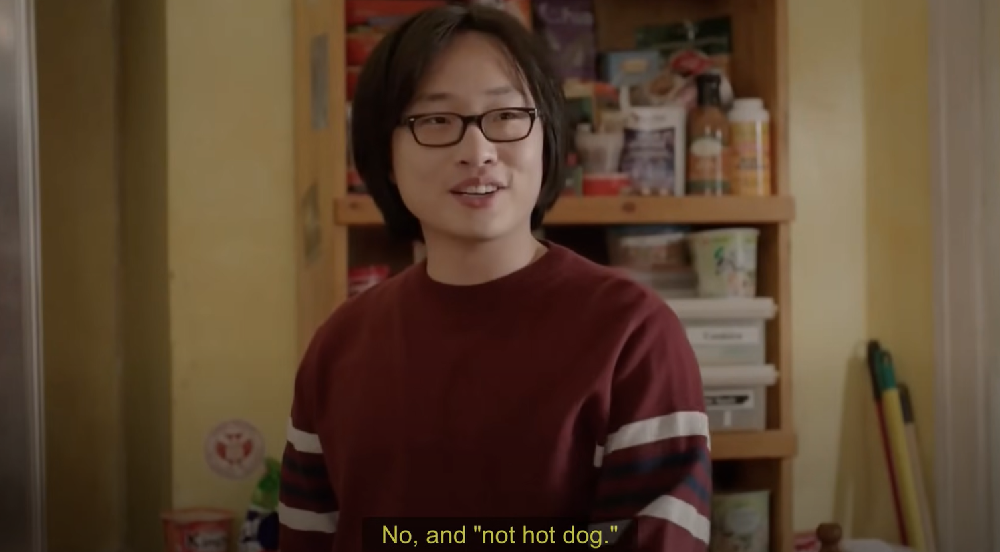
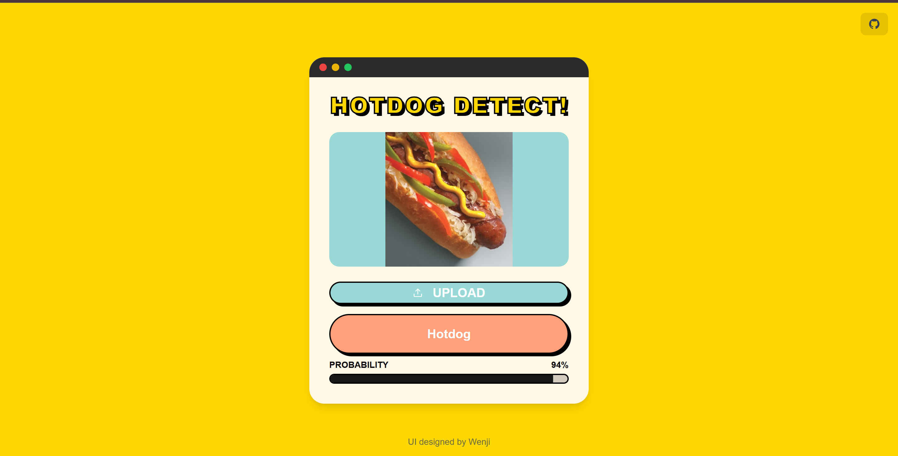

# **Hotdog/Not Hotdog Detector**

If you've seen Silicon Valley, you must be familiar with this application designed by Jian Yang. We chose to implement the complete process of building and deploying the hotdog/nothotdog model as the project for our course [DTU-MLOps](https://skaftenicki.github.io/dtu_mlops/#course-organization). The primary goal of this project is to train a deep learning model that classifies images as either containing a hotdog or not. It's not a difficult task, but it's a good way for us to get familiar with the Machine Learning Operations.

<em>Figure 1: Scene from the TV show "Silicon Valley".</em>

## Visit our website to have a try!
Here is the link of our website: [Hotdog/notHotdog](https://dtuhotdogdetect.vercel.app/). We welcome everyone to use our application to identify hotdog.

<em>Figure 2: The website of our application.</em>

