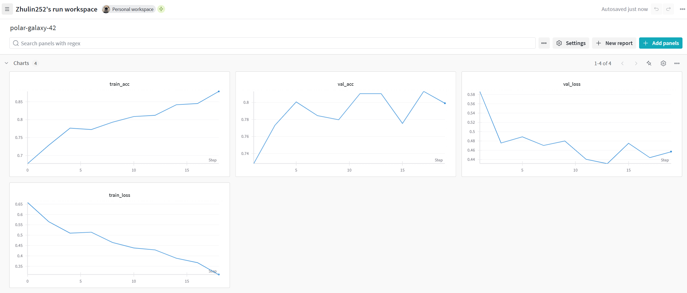

# Exam template for 02476 Machine Learning Operations

This is the report template for the exam. Please only remove the text formatted as with three dashes in front and behind
like:

```--- question 1 fill here ---```

Where you instead should add your answers. Any other changes may have unwanted consequences when your report is
auto-generated at the end of the course. For questions where you are asked to include images, start by adding the image
to the `figures` subfolder (please only use `.png`, `.jpg` or `.jpeg`) and then add the following code in your answer:

```markdown

```

In addition to this markdown file, we also provide the `report.py` script that provides two utility functions:

Running:

```bash
python report.py html
```

Will generate a `.html` page of your report. After the deadline for answering this template, we will auto-scrape
everything in this `reports` folder and then use this utility to generate a `.html` page that will be your serve
as your final hand-in.

Running

```bash
python report.py check
```

Will check your answers in this template against the constraints listed for each question e.g. is your answer too
short, too long, or have you included an image when asked. For both functions to work you mustn't rename anything.
The script has two dependencies that can be installed with

```bash
pip install typer markdown
```

## Overall project checklist

The checklist is *exhaustive* which means that it includes everything that you could do on the project included in the
curriculum in this course. Therefore, we do not expect at all that you have checked all boxes at the end of the project.
The parenthesis at the end indicates what module the bullet point is related to. Please be honest in your answers, we
will check the repositories and the code to verify your answers.

### Week 1

- [x] Create a git repository (M5)
- [x] Make sure that all team members have write access to the GitHub repository (M5)
- [x] Create a dedicated environment for you project to keep track of your packages (M2)
- [x] Create the initial file structure using cookiecutter with an appropriate template (M6)
- [x] Fill out the `data.py` file such that it downloads whatever data you need and preprocesses it (if necessary) (M6)
- [x] Add a model to `model.py` and a training procedure to `train.py` and get that running (M6)
- [x] Remember to fill out the `requirements.txt` and `requirements_dev.txt` file with whatever dependencies that you are using (M2+M6)
- [x] Remember to comply with good coding practices (`pep8`) while doing the project (M7)
- [x] Do a bit of code typing and remember to document essential parts of your code (M7)
- [x] Setup version control for your data or part of your data (M8)
- [x] Add command line interfaces and project commands to your code where it makes sense (M9)
- [x] Construct one or multiple docker files for your code (M10)
- [x] Build the docker files locally and make sure they work as intended (M10)
- [x] Write one or multiple configurations files for your experiments (M11)
- [x] Used Hydra to load the configurations and manage your hyperparameters (M11)
- [x] Use profiling to optimize your code (M12)
- [x] Use logging to log important events in your code (M14)
- [x] Use Weights & Biases to log training progress and other important metrics/artifacts in your code (M14)
- [ ] Consider running a hyperparameter optimization sweep (M14)
- [ ] Use PyTorch-lightning (if applicable) to reduce the amount of boilerplate in your code (M15)

### Week 2

- [x] Write unit tests related to the data part of your code (M16)
- [x] Write unit tests related to model construction and or model training (M16)
- [x] Calculate the code coverage (M16)
- [x] Get some continuous integration running on the GitHub repository (M17)
- [x] Add caching and multi-os/python/pytorch testing to your continuous integration (M17)
- [x] Add a linting step to your continuous integration (M17)
- [x] Add pre-commit hooks to your version control setup (M18)
- [ ] Add a continues workflow that triggers when data changes (M19)
- [ ] Add a continues workflow that triggers when changes to the model registry is made (M19)
- [x] Create a data storage in GCP Bucket for your data and link this with your data version control setup (M21)
- [x] Create a trigger workflow for automatically building your docker images (M21)
- [x] Get your model training in GCP using either the Engine or Vertex AI (M21)
- [x] Create a FastAPI application that can do inference using your model (M22)
- [x] Deploy your model in GCP using either Functions or Run as the backend (M23)
- [x] Write API tests for your application and setup continues integration for these (M24)
- [x] Load test your application (M24)
- [ ] Create a more specialized ML-deployment API using either ONNX or BentoML, or both (M25)
- [x] Create a frontend for your API (M26)

### Week 3

- [x] Check how robust your model is towards data drifting (M27)
- [x] Deploy to the cloud a drift detection API (M27)
- [ ] Instrument your API with a couple of system metrics (M28)
- [ ] Setup cloud monitoring of your instrumented application (M28)
- [ ] Create one or more alert systems in GCP to alert you if your app is not behaving correctly (M28)
- [x] If applicable, optimize the performance of your data loading using distributed data loading (M29)
- [ ] If applicable, optimize the performance of your training pipeline by using distributed training (M30)
- [ ] Play around with quantization, compilation and pruning for you trained models to increase inference speed (M31)

### Extra

- [x] Write some documentation for your application (M32)
- [x] Publish the documentation to GitHub Pages (M32)
- [x] Revisit your initial project description. Did the project turn out as you wanted?
- [x] Create an architectural diagram over your MLOps pipeline
- [x] Make sure all group members have an understanding about all parts of the project
- [x] Uploaded all your code to GitHub

## Group information

### Question 1
> **Enter the group number you signed up on <learn.inside.dtu.dk>**
>
> Answer:
88

### Question 2
> **Enter the study number for each member in the group**
>
> Example:
>
> *sXXXXXX, sXXXXXX, sXXXXXX*
>
> Answer:

s242597, s232291, s242519

### Question 3
> **A requirement to the project is that you include a third-party package not covered in the course. What framework**
> **did you choose to work with and did it help you complete the project?**
>
> Recommended answer length: 100-200 words.
>
> Example:
> *We used the third-party framework ... in our project. We used functionality ... and functionality ... from the*
> *package to do ... and ... in our project*.
>
> Answer:

For the frontend development in our project, we chose the React JavaScript library, which provided significant flexibility and adaptability. Compared to alternatives like Streamlit, React allowed us to fine-tune the interactive user flow across the entire application, giving us complete control over both the design and functionality. This choice was instrumental in ensuring that the application was highly responsive, enabling it to run seamlessly across a range of devices, including both desktop computers and mobile phones. To further enhance our development process, we integrated the Next.js framework, which extends React's capabilities by enabling the implementation of both backend and frontend functionalities within a unified codebase. This not only streamlined our workflow but also simplified the maintenance and deployment of the application. For styling, we utilized Shadcn and Tailwind CSS libraries, which provided us with robust tools for creating a modern, visually appealing, and highly customizable user interface. These choices collectively empowered us to build a web application that was both functional and aesthetically refined.

## Coding environment

> In the following section we are interested in learning more about you local development environment. This includes
> how you managed dependencies, the structure of your code and how you managed code quality.

### Question 4

> **Explain how you managed dependencies in your project? Explain the process a new team member would have to go**
> **through to get an exact copy of your environment.**
>
> Recommended answer length: 100-200 words
>
> Example:
> *We used ... for managing our dependencies. The list of dependencies was auto-generated using ... . To get a*
> *complete copy of our development environment, one would have to run the following commands*
>
> Answer:

Our team employs Conda for managing Python environments effectively. The project repository was created using Cookiecutter in conjunction with the MLOps template, while the dependency list was generated with pipreqs. For code linting and formatting, Ruff is utilized during the pre-commit phase. Source code version control is handled through GitHub, ensuring smooth collaboration. On the data version control side, datasets are stored in Google Cloud Platform (GCP) buckets and managed using DVC. To get a complete copy of our development environment, one simply needs to install Python, clone the GitHub repository and install the specified Python dependencies with following commands:
conda create \-n mlops python=3.11
conda activate mlops
git clone [https://github.com/ZhuMuMu0216/MLOps](https://github.com/ZhuMuMu0216/MLOps)
pip install requirements.txt
pip install requirements\_api.txt
pip install requirements\_dev.txt
pip install \-e .

### Question 5

> **We expect that you initialized your project using the cookiecutter template. Explain the overall structure of your**
> **code. What did you fill out? Did you deviate from the template in some way?**
>
> Recommended answer length: 100-200 words
>
> Example:
> *From the cookiecutter template we have filled out the ... , ... and ... folder. We have removed the ... folder*
> *because we did not use any ... in our project. We have added an ... folder that contains ... for running our*
> *experiments.*
>
> Answer:

From the cookiecutter template we have filled out the .github, dockerfiles, keys, models, reports, src, tests folders.
We added some workflow files to .github/workflows folder for Github Actions and adjusted the denpendabot.yaml.
Based on our project, we made adjustments to .pre-commit-config.yaml, pyproject.toml, requirements\_txt, requirements\_dev.txt and tasks.py files.
We added .dvcignore for the DVC service, cloud_build_and_deploy.yaml for using GCP to build and deploy docker images, data.dvc for data version control.
We have removed the docs files since we are providing a simple service which doesn’t need too much documentation. A ReadMe.md file is expected to be enough.
The notebooks folder was also removed since we didn’t use Jupyter notebooks in our project.
The .dvc folder was added for storing DVC config and necessary files for data version control.

### Question 6

> **Did you implement any rules for code quality and format? What about typing and documentation? Additionally,**
> **explain with your own words why these concepts matters in larger projects.**
>
> Recommended answer length: 100-200 words.
>
> Example:
> *We used ... for linting and ... for formatting. We also used ... for typing and ... for documentation. These*
> *concepts are important in larger projects because ... . For example, typing ...*
>
> Answer:

For linting and formatting, we used Ruff. While we didn’t implement strict rules for typing or documentation, the README.md file was sufficient for a small-scale project. However, in larger projects, these practices become crucial for several reasons.
First, enforcing coding standards through tools like linters ensures consistent code quality and readability, especially when multiple developers collaborate. Typing, such as using type annotations, helps to catch potential bugs during development and enhances code clarity, making it easier for team members to understand function inputs and outputs.
Documentation also plays a critical role in large projects. Comprehensive documentation allows new developers to onboard quickly, provides clear guidance on using APIs, and helps maintain the project over time. Without proper documentation and clear typing, the complexity of larger projects can lead to miscommunication and errors, slowing down development and maintenance processes. Therefore, while less critical for small-scale work, these practices are indispensable in more extensive, collaborative projects.

## Version control

> In the following section we are interested in how version control was used in your project during development to
> corporate and increase the quality of your code.

### Question 7

> **How many tests did you implement and what are they testing in your code?**
>
> Recommended answer length: 50-100 words.
>
> Example:
> *In total we have implemented X tests. Primarily we are testing ... and ... as these the most critical parts of our*
> *application but also ... .*
>
> Answer:

In total we have implemented 3 tests. Primarily we are testing the file structure of datasets, check if train and test folders have been separated, and validate the usability of our image datasets. Also, the initialization of the pre-trained model, the forward pass with some random data, and the shape of output have been tested. In addition, we implemented usability tests and load tests on our APIs.

### Question 8

> **What is the total code coverage (in percentage) of your code? If your code had a code coverage of 100% (or close**
> **to), would you still trust it to be error free? Explain you reasoning.**
>
> Recommended answer length: 100-200 words.
>
> Example:
> *The total code coverage of code is X%, which includes all our source code. We are far from 100% coverage of our **
> *code and even if we were then...*
>
> Answer:

The total code coverage of our code is 85%, which includes most of the source code. However, even with a code coverage of 100%, we cannot assume the code is completely error-free. Code coverage only indicates that the written tests have executed all or most parts of the code, but it doesn’t guarantee the absence of logical, functional, or performance-related issues.
For instance, the quality of the tests is just as important as their quantity. If the tests themselves are poorly designed, incomplete, or fail to consider edge cases, they may miss critical bugs. Additionally, high coverage does not account for untested interactions between components or unexpected input scenarios.
Therefore, while a high coverage rate is valuable for assessing test comprehensiveness, it should not be the sole indicator of code reliability. Complementary practices, such as code reviews, dynamic testing, and monitoring in production, are essential to ensure overall quality and robustness.

### Question 9

> **Did you workflow include using branches and pull requests? If yes, explain how. If not, explain how branches and**
> **pull request can help improve version control.**
>
> Recommended answer length: 100-200 words.
>
> Example:
> *We made use of both branches and PRs in our project. In our group, each member had an branch that they worked on in*
> *addition to the main branch. To merge code we ...*
>
> Answer:

Our project relies on both branches and pull requests for effective collaboration. Each team member works on an individual branch to implement different components of the project simultaneously. Direct commits to the main branch are strictly prohibited. Before pushing code to the remote repository, team members must run and pass local tests, including pre-commit checks. Additionally, our GitHub repository utilizes GitHub Actions to automate pre-commit validations and unit tests. A pull request is approved, and the changes are merged into the main branch only if all GitHub Actions complete successfully without errors. This branching strategy facilitates collaboration among a large team while ensuring the stability of the main branch, as well as the clear management of development and feature branches.

### Question 10

> **Did you use DVC for managing data in your project? If yes, then how did it improve your project to have version**
> **control of your data. If no, explain a case where it would be beneficial to have version control of your data.**
>
> Recommended answer length: 100-200 words.
>
> Example:
> *We did make use of DVC in the following way: ... . In the end it helped us in ... for controlling ... part of our*
> *pipeline*
>
> Answer:

We integrated DVC into our project and found it to be an extremely useful tool. The datasets were stored in Google Cloud Storage buckets, and DVC was employed to manage and track their versions effectively. Although the datasets were not updated during this project, DVC’s git-like commands, such as dvc pull and dvc push, proved to be highly efficient and easy to get started. These commands allowed us to seamlessly retrieve and synchronize datasets in a local development environment, a docker environment, and a cloud environment. This capability significantly streamlined our workflow by ensuring consistent access to data in all environments. Additionally, DVC’s ability to synchronize changes to datasets between different environments is a critical feature that aligns well with the principles of continuous integration and continuous deployment. By enabling easy tracking and management of data across the project lifecycle, DVC contributed to both the efficiency and scalability of our development process.

### Question 11

> **Discuss you continuous integration setup. What kind of continuous integration are you running (unittesting,**
> **linting, etc.)? Do you test multiple operating systems, Python  version etc. Do you make use of caching? Feel free**
> **to insert a link to one of your GitHub actions workflow.**
>
> Recommended answer length: 200-300 words.
>
> Example:
> *We have organized our continuous integration into 3 separate files: one for doing ..., one for running ... testing*
> *and one for running ... . In particular for our ..., we used ... .An example of a triggered workflow can be seen*
> *here: <weblink>*
>
> Answer:

Our continuous integration process is divided into two main components. The first is the implementation of pre-commit hooks in the local development environment. These hooks include checks for trailing whitespaces, end-of-line consistency, YAML and JSON file validation, and large file detection. Once these initial checks are complete, the linter and formatter from Ruff are executed to ensure code quality and consistency.
The second component involves GitHub Actions. Within the project repository, we maintain two separate workflow files under the .github folder. These workflows incorporate several automated tasks, such as running unit tests across multiple Python versions (though at last we kept only one version to reduce the testing time), retrieving data from Google Cloud Storage buckets using DVC, and performing coverage tests to measure code testing completeness. Additionally, the workflows handle the building of Docker images and their subsequent submission to Google Artifact Registry.
Initially, we configured GitHub Actions to run on multiple operating systems. However, we later streamlined this setup by limiting the runner platform to Ubuntu, as the Docker and cloud environments for deployment also operate in Unix-based systems. This optimization simplified our workflows and eliminated unnecessary configurations.
To further enhance efficiency, we leveraged GitHub Actions’ caching mechanism for package dependencies. This significantly reduced the time required for dependency installation, improving the overall performance of the continuous integration pipeline.
Here is a link to one of our GitHub actions workflow runs: https://github.com/ZhuMuMu0216/MLOps/actions/runs/12877958593

## Running code and tracking experiments

> In the following section we are interested in learning more about the experimental setup for running your code and
> especially the reproducibility of your experiments.

### Question 12

> **How did you configure experiments? Did you make use of config files? Explain with coding examples of how you would**
> **run a experiment.**
>
> Recommended answer length: 50-100 words.
>
> Example:
> *We used a simple argparser, that worked in the following way: Python  my_script.py --lr 1e-3 --batch_size 25*
>
> Answer:

We use hydra to configure our experiments. We make the config.yaml under the directory configs. However, In our project we only configure the hyper parameters.
Besides, we use invoke commands to run our experiment easily which is written in the tasks.py and works in the following way: *invoke train*
then it will train the model with hyper parameters in config.yaml.

### Question 13

> **Reproducibility of experiments are important. Related to the last question, how did you secure that no information**
> **is lost when running experiments and that your experiments are reproducible?**
>
> Recommended answer length: 100-200 words.
>
> Example:
> *We made use of config files. Whenever an experiment is run the following happens: ... . To reproduce an experiment*
> *one would have to do ...*
>
> Answer:

We used a config file to systematically record all experimental hyperparameters. This included details such as learning rates and epochs (other needs can also be added). By maintaining these parameters in a single, well-documented file, Other users can directly use the hyperparameters I used, which is important in deep learning tasks.
We utilized a dockerfile to create a reproducible and isolated environment. This Docker image contained all the required dependencies, libraries, and configurations pre-installed. By running my experiments in this fixed environment, we  can guarantee consistent results across different machines. At the same time, it also avoids the problems between environment and system.
These two approaches allowed us to achieve full reproducibility of my experiments.

### Question 14

> **Upload 1 to 3 screenshots that show the experiments that you have done in W&B (or another experiment tracking**
> **service of your choice). This may include loss graphs, logged images, hyperparameter sweeps etc. You can take**
> **inspiration from [this figure](figures/wandb.png). Explain what metrics you are tracking and why they are**
> **important.**
>
> Recommended answer length: 200-300 words + 1 to 3 screenshots.
>
> Example:
> *As seen in the first image when have tracked ... and ... which both inform us about ... in our experiments.*
> *As seen in the second image we are also tracking ... and ...*
>
> Answer:




As seen in the first image, we have tracked loss graphs and accuracy graphs, which provide critical insights into the performance of our model during training. Monitoring loss helps us evaluate how effectively the model minimizes the error between predictions and actual outcomes. By observing loss trends, we can identify potential issues like overfitting or underfitting and determine when the model reaches optimal performance. When the val accuracy tends to be stable and the train accuracy is still rising, it can be determined that overfitting has occurred, and we can use the early stopping method. In addition, you can actually monitor other metrics.

In the second image, we observe system performance metrics, which are default features in wandb. Efficient resource management is crucial for training large models, as it directly impacts training time and scalability. For instance, if system metrics reveal that the model excessively strains the GPU or CPU, we might consider upgrading hardware. Tracking system metrics enables optimized resource allocation, ensuring stable, efficient, and scalable training workflows.

In the third image, we use wandb to record hyperparameters(epochs, learning rate) and basic information of the model(architecture, dataset). This helps us review after completing all experiments.

### Question 15

> **Docker is an important tool for creating containerized applications. Explain how you used docker in your**
> **experiments/project? Include how you would run your docker images and include a link to one of your docker files.**
>
> Recommended answer length: 100-200 words.
>
> Example:
> *For our project we developed several images: one for training, inference and deployment. For example to run the*
> *training docker image: `docker run trainer:latest lr=1e-3 batch_size=64`. Link to docker file: <weblink>*
>
> Answer:

As part of this project, we developed two distinct Docker images: one for model training and another for inference.

The model training image played a pivotal role, as it bundled all the essential commands and dependencies required for training. However, we encountered challenges in securely passing authentication tokens into the image, which required additional effort to resolve. Since critical hyperparameters were already fine-tuned during the training process, we left only the number of epochs as an adjustable argument. For instance, the command `docker run --rm -it train:latest epoch=5` was used to initiate training (details in the [Dockerfile](https://github.com/ZhuMuMu0216/MLOps/blob/main/dockerfiles/train.dockerfile)).

The inference image, on the other hand, is more straightforward and can be launched directly using the command `docker run -it -p 8080:8080 inference:latest`.

That said, these docker images are primarily designed for automated building, deployment and use in GCP. Additional operations, such as injecting secret json files and copying data, are automatically handled during the build and deployment process. Running an image locally using `docker run` requires more manual operations to replicate the pipeline's behavior.

### Question 16

> **When running into bugs while trying to run your experiments, how did you perform debugging? Additionally, did you**
> **try to profile your code or do you think it is already perfect?**
>
> Recommended answer length: 100-200 words.
>
> Example:
> *Debugging method was dependent on group member. Some just used ... and others used ... . We did a single profiling*
> *run of our main code at some point that showed ...*
>
> Answer:

Throughout our project, we employed various debugging techniques depending on the situation. For example, when we attempted to run the training image in a Docker container for the first time, the container unexpectedly shut down without providing any error messages. To troubleshoot, we added multiple print statements throughout the code to track its progress. This approach allowed us to identify which sections of the code were successfully executed before the shutdown, offering valuable insights for further debugging. In other cases, we leveraged the built-in debugger in VSCode, which proved to be both straightforward and efficient. What’s more, we use `pdb` to debug when we meet errors during training the model.

Additionally, we performed code profiling using tools like cProfile and PyTorch’s profiling utilities. This helped us pinpoint issues related to the data loader, which we successfully resolved. After implementing optimizations, our final training code achieved significant improvements, completing one training epoch in just 8 seconds when utilizing CUDA. These debugging and profiling efforts were crucial in refining our code and enhancing its overall performance.

## Working in the cloud

> In the following section we would like to know more about your experience when developing in the cloud.

### Question 17

> **List all the GCP services that you made use of in your project and shortly explain what each service does?**
>
> Recommended answer length: 50-200 words.
>
> Example:
> *We used the following two services: Engine and Bucket. Engine is used for... and Bucket is used for...*
>
> Answer:

We used Cloud Storage Buckets, Compute Engine, Cloud Build, Artifact Registry, and Cloud Run. Buckets are used to save our datasets and every version of trained weights. Compute Engine is used for testing. Cloud Build is used to build docker images. Artifact Registry is used to store docker images. Cloud Run Jobs is used for running the training image and Cloud Run Services is used for deploying and running the inference service.

### Question 18

> **The backbone of GCP is the Compute engine. Explained how you made use of this service and what type of VMs**
> **you used?**
>
> Recommended answer length: 100-200 words.
>
> Example:
> *We used the compute engine to run our ... . We used instances with the following hardware: ... and we started the*
> *using a custom container: ...*
>
> Answer:

We used the compute engine to test our training and inference Docker images. We used instances with the following hardware specifications (E2-medium machine type): 2 vCPU, 4 GB memory, 20 GB balanced persistent disk, x86/64 architecture. We started with a default container because we wanted our VM to be clean and only installed what we needed by ourselves. In fact, we mainly used the VM for testing our code and images. However, it was too standalone to be integrated into our CI/CD pipeline. For integration into an automated process, it would require deployment with a heavy backend. This approach was unrealistic for a small team within a timeframe of only two to three weeks. As a result, we chose to use Cloud Run instead.

### Question 19

> **Insert 1-2 images of your GCP bucket, such that we can see what data you have stored in it.**
> **You can take inspiration from [this figure](figures/bucket.png).**
>
> Answer:


### Question 20

> **Upload 1-2 images of your GCP artifact registry, such that we can see the different docker images that you have**
> **stored. You can take inspiration from [this figure](figures/registry.png).**
>
> Answer:


### Question 21

> **Upload 1-2 images of your GCP cloud build history, so we can see the history of the images that have been build in**
> **your project. You can take inspiration from [this figure](figures/build.png).**
>
> Answer:


### Question 22

> **Did you manage to train your model in the cloud using either the Engine or Vertex AI? If yes, explain how you did**
> **it. If not, describe why.**
>
> Recommended answer length: 100-200 words.
>
> Example:
> *We managed to train our model in the cloud using the Engine. We did this by ... . The reason we choose the Engine*
> *was because ...*
>
> Answer:

We successfully trained our model in the cloud using Cloud Run Jobs. Initially, we considered using Compute Engine, but automating the training process on it proved too challenging. We then attempted to use Vertex AI, but this approach was unsuccessful because the minimum requirement for custom training jobs was 2 vCPUs, which exceeded our 1 vCPU quota. Despite searching for solutions online and reaching out to Google’s sales team, we were unable to resolve this issue.

Later, our professor provided us with a $50 education coupon. After redeeming it and creating a new project linked to the coupon, we were granted a 40 vCPU quota and some GPU resources. However, by that point, most of the project configuration was already completed, and setting up a new project and redoing the work would have required significant effort. Given these circumstances, we opted to use Cloud Run Jobs to execute our training image directly. The trained model weights were then stored in Cloud Storage Buckets, which allowed us to proceed efficiently without reworking prior progress.

## Deployment

### Question 23

> **Did you manage to write an API for your model? If yes, explain how you did it and if you did anything special. If**
> **not, explain how you would do it.**
>
> Recommended answer length: 100-200 words.
>
> Example:
> *We did manage to write an API for our model. We used FastAPI to do this. We did this by ... . We also added ...*
> *to the API to make it more ...*
>
> Answer:

We did manage to write an API for our model. We used FastAPI to implement the API, which provides endpoints for predicting image categories and checking the system's health. The main endpoint, `/predict`, accepts image files (JPG, JPEG, PNG), validates their format, processes the input, and uses a trained ResNet18 model to classify images as "hotdog" or "not hotdog." The `/health` endpoint is included for health checks to ensure the model is loaded and the service is operational.

To enhance the process, we designed the API with an async lifecycle using FastAPI's `lifespan` feature, which handles tasks such as downloading the trained model weights from Google Cloud Storage (GCS) at startup and cleaning up temporary resources on shutdown. Images are preprocessed with `torchvision` to prepare them for inference.

### Question 24

> **Did you manage to deploy your API, either in locally or cloud? If not, describe why. If yes, describe how and**
> **preferably how you invoke your deployed service?**
>
> Recommended answer length: 100-200 words.
>
> Example:
> *For deployment we wrapped our model into application using ... . We first tried locally serving the model, which*
> *worked. Afterwards we deployed it in the cloud, using ... . To invoke the service an user would call*
> *`curl -X POST -F "file=@file.json"<weburl>`*
>
> Answer:

We successfully deployed our API both locally and in the cloud. We started by testing the API locally using FastAPI's built-in frontend at http://localhost:8080/docs to interact with the API and perform predictions, which worked without any issues.

Next, we packaged the API service into a Docker image and tested it within the container environment to ensure it worked well and that the image had no issues.

Finally, we deployed the API to Google Cloud Run, where we exposed the service publicly for external access. The deployment process involved pushing the Docker image to Google Artifact Registry and configuring the Cloud Run service. To reduce the cold start time, we set the minimum number of instances to 1. To make the service accessible and user-friendly, we built a dedicated frontend at [https://dtuhotdogdetect.vercel.app/](https://dtuhotdogdetect.vercel.app/), which interacts with the deployed API. This frontend allows users to upload images and receive predictions, providing a seamless experience for invoking the service.

### Question 25

> **Did you perform any unit testing and load testing of your API? If yes, explain how you did it and what results for**
> **the load testing did you get. If not, explain how you would do it.**
>
> Recommended answer length: 100-200 words.
>
> Example:
> *For unit testing we used ... and for load testing we used ... . The results of the load testing showed that ...*
> *before the service crashed.*
>
> Answer:

For unit testing, we relied on the pytest framework to ensure the functionality and reliability of our code. We began by verifying that the folder structure for both the training and testing datasets was correct. Next, we used the image data to create data loader instances and validated the shape of the data. Following this, we tested a pre-trained model by feeding it data with varying batch sizes to ensure it could perform forward propagation correctly and return predictions with the expected shape.
In addition to unit tests, we implemented integration and load tests for our API endpoint. The integration test involved uploading an image file to the API and verifying that the returned JSON contained the correct keys and values. For load testing, we used Locust to simulate high traffic by emulating a large number of users accessing the endpoint. Specifically, we tested the service with 200 concurrent users and a ramp-up rate of 10 users per second. The results were impressive, as our service handled the load smoothly, even though we had not focused on concurrency or performance optimization.

### Question 26

> **Did you manage to implement monitoring of your deployed model? If yes, explain how it works. If not, explain how**
> **monitoring would help the longevity of your application.**
>
> Recommended answer length: 100-200 words.
>
> Example:
> *We did not manage to implement monitoring. We would like to have monitoring implemented such that over time we could*
> *measure ... and ... that would inform us about this ... behaviour of our application.*
>
> Answer:

Yes, we could monitor the data drifting and target drifting through `evidently ai`. Each time when you call our API, our API will record your input image, calculate features of the image and upload it to the bucket in the cloud storage as a json file.  Every once in a while, we will collect the data in all json files as current data, and then use the data in the training set as reference data. Use evidently ai to compare the two sets of data to observe if the distributions of the data and prediction results have significant changes.
If we find that there is a significant shift in the features of user input images, we need to finetune the model and strengthen the special distribution to enhance the generalization ability of our model.

## Overall discussion of project

> In the following section we would like you to think about the general structure of your project.

### Question 27

> **How many credits did you end up using during the project and what service was most expensive? In general what do**
> **you think about working in the cloud?**
>
> Recommended answer length: 100-200 words.
>
> Example:
> *Group member 1 used ..., Group member 2 used ..., in total ... credits was spend during development. The service*
> *costing the most was ... due to ... . Working in the cloud was ...*
>
> Answer:

Up to 19th Jan, we have used 32 krone and 3.2 dollar in total (We use the free credit from Google before getting the credits from the learn). The Compute Engine incurred the highest cost of 23.37 krone because we used it for model training and testing in the early stages. However, we later migrated to Cloud Run. Artifact registry is the second most expensive service, because every time we merge the code to the main branch on GitHub, we will rebuild all the images in the cloud and upload them to the Artifact Registry, which takes up a lot of memory and costs a lot of credits.

Overall speaking, working in the cloud is very convenient, though it can sometimes be troublesome to familiarize yourself with various commands, authorization processes, and configuration environments. This way, we are not constrained by the limited performance of our computers. Once tasks are deployed, we can shut down our computers at any time, which adds to the convenience.

### Question 28

> **Did you implement anything extra in your project that is not covered by other questions? Maybe you implemented**
> **a frontend for your API, use extra version control features, a drift detection service, a kubernetes cluster etc.**
> **If yes, explain what you did and why.**
>
> Recommended answer length: 0-200 words.
>
> Example:
> *We implemented a frontend for our API. We did this because we wanted to show the user ... . The frontend was*
> *implemented using ...*
>
> Answer:

We implemented a frontend for our API using React, Next.js and TailwindCSS. Go check it out: https://dtuhotdogdetect.vercel.app/

Besides, as mentioned earlier, we used Cloud Run Jobs instead of Compute Engine or Vertex AI to train our model.

### Question 29

> **Include a figure that describes the overall architecture of your system and what services that you make use of.**
> **You can take inspiration from [this figure](figures/overview.png). Additionally, in your own words, explain the**
> **overall steps in figure.**
>
> Recommended answer length: 200-400 words
>
> Example:
>
> *The starting point of the diagram is our local setup, where we integrated ... and ... and ... into our code.*
> *Whenever we commit code and push to GitHub, it auto triggers ... and ... . From there the diagram shows ...*
>
> Answer:
>


The starting point of the pipeline is the development team. Developers can utilize DVC to modify datasets. When changes are made to the source code, pre-commit hooks are triggered automatically. These hooks perform checks for trailing whitespaces, end-of-line consistency, YAML and JSON file validation, and large file detection. After these initial checks are completed, the linter and formatter provided by Ruff are executed to ensure code quality and consistency.

After pre-commit hooks, developers are able to commit and push their code changes to Github. Since we require only pull requests that passed several tests from Github Actions can be finally merged into the main branch, all pull requests will trigger Github Actions workflows. These workflows incorporate several automated tasks, such as running unit tests across multiple Python versions and performing coverage tests to measure code testing completeness.

Additionally, the workflows request the Google Cloud Build to conduct the building of the training and inference Docker images and their subsequent submission to Google Artifact Registry. The datasets are pulled using dvc from Google Cloud Storage Buckets as part of the workflow and then copied into the training image. After that, the training image is deployed to Google Cloud Jobs while the inference service image is deployed to Google Cloud Services.

In the usage phase, we developers manually execute Google Cloud Run Jobs to run the training docker container with hyperparameters passed as arguments. The trained weights are then saved back to the storage buckets. Another Google Cloud Run instance hosts an inference container, which uses FastAPI to provide API services for users. Since we have developed a frontend for this service, users can easily access it via the webpage https://dtuhotdogdetect.vercel.app/ by uploading an image file. The prediction results, along with the corresponding probabilities, are then displayed.

### Question 30

> **Discuss the overall struggles of the project. Where did you spend most time and what did you do to overcome these**
> **challenges?**
>
> Recommended answer length: 200-400 words.
>
> Example:
> *The biggest challenges in the project was using ... tool to do ... . The reason for this was ...*
>
> Answer:

The project presented several challenges, with two areas requiring the most effort. First, creating the Dockerfile and working on it were challenging. We struggled with understanding how to add files, configure the environment, and properly execute the Dockerfile to build the image. The lack of prior experience made it overwhelming. To overcome this, we referred to Docker’s documentation, explored online tutorials on YouTube and BiliBili. Gradually, we became more comfortable with specifying dependencies, copying files into the image, and using commands like RUN, COPY, and CMD effectively. Testing the container in iterative cycles helped refine the setup. After finishing the train.dockerfile, it became much easier to make the api.dockerfile. For example, I did not add all the required dependencies to the image at the beginning, which caused the image to always fail when I generated the json file. Later I found that I needed to install the system build dependencies and install Rust. Make sure you have a careful check about all the dependencies when u build the image.

The second significant challenge was deploying the model training and API on the cloud. This involved connecting multiple components: accessing data in the cloud, training the model, saving it, deploying the API, and retrieving the model efficiently. Each step required understanding the interaction between cloud storage, compute engine, and cloud run. To tackle this, we broke down the tasks, systematically testing and validating each connection. Leveraging cloud provider documentation and online resources was invaluable. These struggles enhanced our understanding of containerization and cloud-based workflows, significantly contributing to the project’s success.

### Question 31

> **State the individual contributions of each team member. This is required information from DTU, because we need to**
> **make sure all members contributed actively to the project. Additionally, state if/how you have used generative AI**
> **tools in your project.**
>
> Recommended answer length: 50-300 words.
>
> Example:
> *Student sXXXXXX was in charge of developing of setting up the initial cookie cutter project and developing of the*
> *docker containers for training our applications.*
> *Student sXXXXXX was in charge of training our models in the cloud and deploying them afterwards.*
> *All members contributed to code by...*
> *We have used ChatGPT to help debug our code. Additionally, we used GitHub Copilot to help write some of our code.*
> Answer:

In team 88, each team member contributed equally and actively to this project. Roughly speaking, student s232291 was responsible for model related work, s242597 was responsible for GitHub Actions related work, s242519 was responsible for GCP related work. That said, many tasks were completed collaboratively. and Besides, every member knows details about the whole project.

During this project, we have used ChatGPT for debugging and coding, gathering information about error messages, searching for solutions, translating different languages, correcting grammar errors, and paraphrasing texts. Also, we used Github Copilot for explaining source code, reorganizing structure, and assisting code writing.
